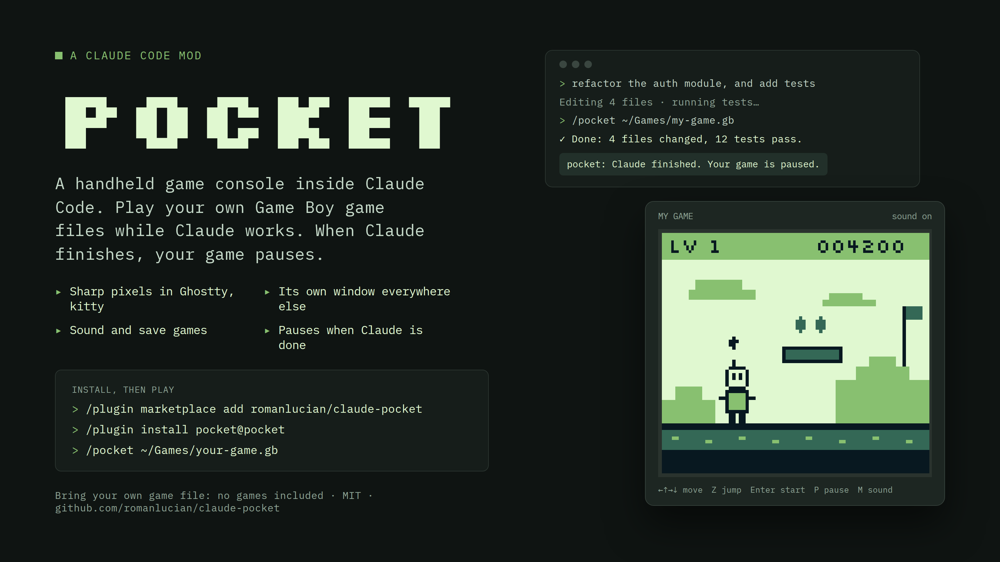
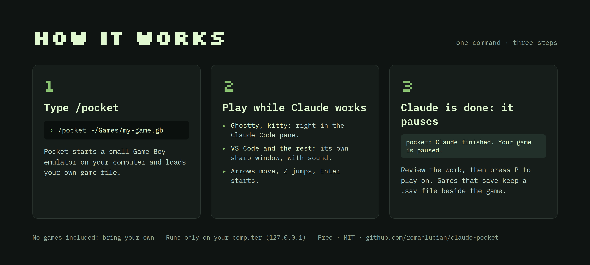

# pocket — a handheld game console inside Claude Code



A Claude Code mod that runs a small Game Boy (DMG) emulator, so you can play
while Claude works: in the Claude Code pane (Ghostty, kitty) or in its own
window (VS Code and the rest). When Claude finishes a turn, the game pauses
for you.



```
/pocket ~/Games/my-game.gb
```

**No games are included.** Pocket plays only the game file you give it — use a
backup you made from a cartridge you own. This repository does not include,
download or link to any game files.

## Install

In Claude Code:

```
/plugin marketplace add romanlucian/claude-pocket
/plugin install pocket@pocket
```

Pocket needs **Node.js** (the emulator runs in its own Node process). If Claude
Code can't find `node`, set its full path in the mod's settings (`Node command`;
run `which node` in a terminal to see it).

## Play

```
/pocket ~/path/to/your-game.gb
```

That's it. Where the game shows depends on your terminal:

- **Ghostty or kitty:** right in the Pocket pane, with real pixels. Click the
  pad line under the screen so it has the keyboard; **Esc** gives it back to
  Claude.
- **VS Code's terminal and the others:** a terminal like these can only draw
  blocks of text, so the game opens in **its own window**, sharp at any size.
  It is a clean app window when Chrome, Edge, Brave or Arc is installed (else
  a browser tab). The pane keeps the controls. Closed the window? Press
  **Show game window**.

**Play in a window** / **Play in this pane** switches between the two (the
choice is kept).

| Key | Button |
| --- | --- |
| ← ↑ → ↓ | D-pad |
| Z | A |
| X | B |
| Enter | Start |
| Space (pane) / Shift (window) | Select |
| P | Pause / resume |

The pane also has Pause/Resume, Restart, Stop and *Pause when Claude
finishes* (on by default: when Claude finishes a turn, your game pauses).
`/pocket` with no file reopens the last game; `/pocket stop` stops it.

The game window is a page on your own computer only (127.0.0.1, at a secret
address), and it closes when the game stops. A browser knows when you let go
of a key, so the controls there feel exactly like the console's.

## What works, what doesn't

- Game Boy (DMG) games with no mapper, MBC1, MBC3 or MBC5 cartridges.
- Passes the blargg `cpu_instrs` and `instr_timing` tests and matches the
  `dmg-acid2` reference picture.
- **Sound** in the game window: both square channels, the wave channel and
  noise, in stereo. It starts with your first key press there (browsers
  wait for one); **M** turns it off and on. The pane in Ghostty or kitty is
  silent: a terminal plays no sound. Passes 9 of blargg's 12 `dmg_sound`
  tests (the three left are about reading the wave memory mid-note).
- **Saves:** a game that saves (a battery in the cartridge, like Pokémon or
  Zelda) keeps its save in `your-game.sav` beside the game file, the same
  file other emulators use, so you can bring your saves along. It is written
  a second after the game saves and when you stop. The pane says when a save
  was loaded. (An MBC3 cartridge's clock is not kept.)
- In the pane, keys are presses only (a terminal reports no releases), so a
  key is held for a short moment after each press. The game window has real
  key releases.
- Game Boy Color games are not supported.

## How it works

- `core/` — the emulator: CPU (`cpu.mjs`), sound (`apu.mjs`) and the rest
  of the machine: cartridge and saves, timer, picture, joypad
  (`machine.mjs`). Plain JavaScript, no dependencies.
- `runner/pocket.mjs` — runs the emulator in real time (~60 fps) in a Node
  process, streams frames on stdout and takes keys over a local socket.
- `runner/web.mjs` — the game window: a page on 127.0.0.1 drawing frames on
  a canvas and playing the sound.
- `hooks/` — the mod: the `/pocket` command, the pane, the key pad, and the
  auto-pause when Claude finishes a turn.

Run the tests with `claude plugin test`.

## License

MIT © 2026 Lucian Roman. Game Boy is a trademark of Nintendo; this project is not
affiliated with or endorsed by Nintendo.
